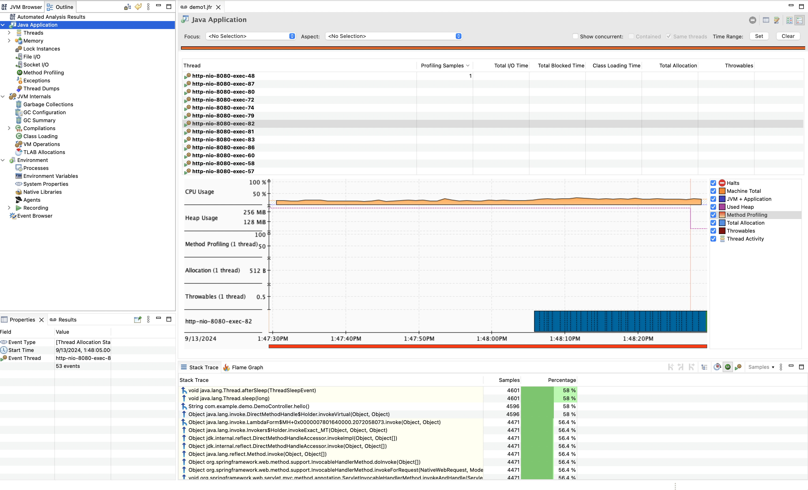
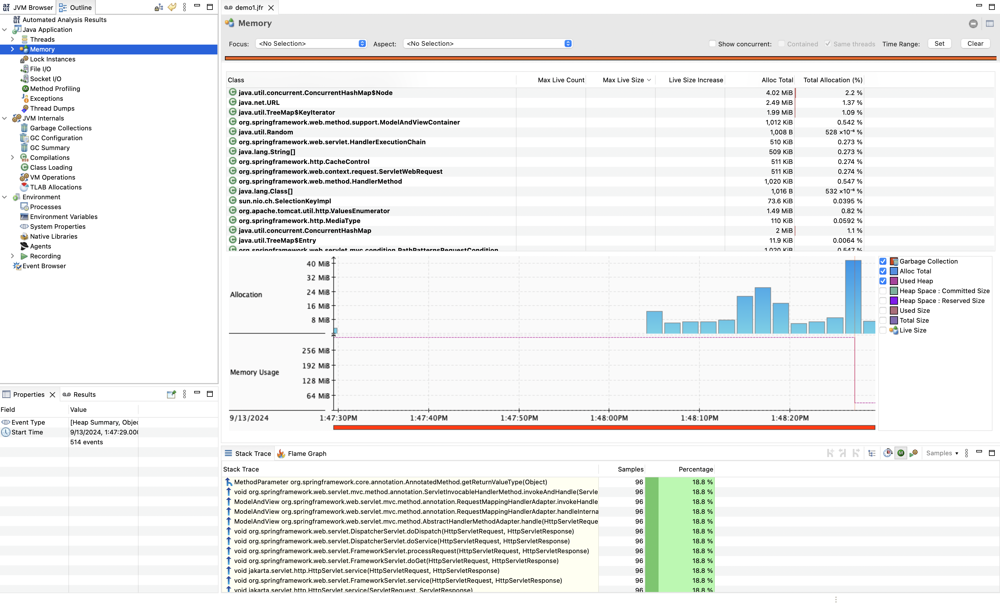

# JFR Demo

## JFR Flags

-XX:StartFlightRecording=delay=5s,disk=false,dumponexit=true,duration=60s,filename=demo.jfr 
-XX:FlightRecorderOptions=duration=60s,filename=demo.jfr -XX:FlightRecorderOptions=stackdepth=128,maxchunksize=2M

## Run application

```shell
sh run.sh
```

## Download JMC

Download [JMC](https://www.azul.com/products/components/azul-mission-control/#downloads) and install it.

## Open JFR Dashboard

Open `demo.jfr` file in JMC dashboard.



